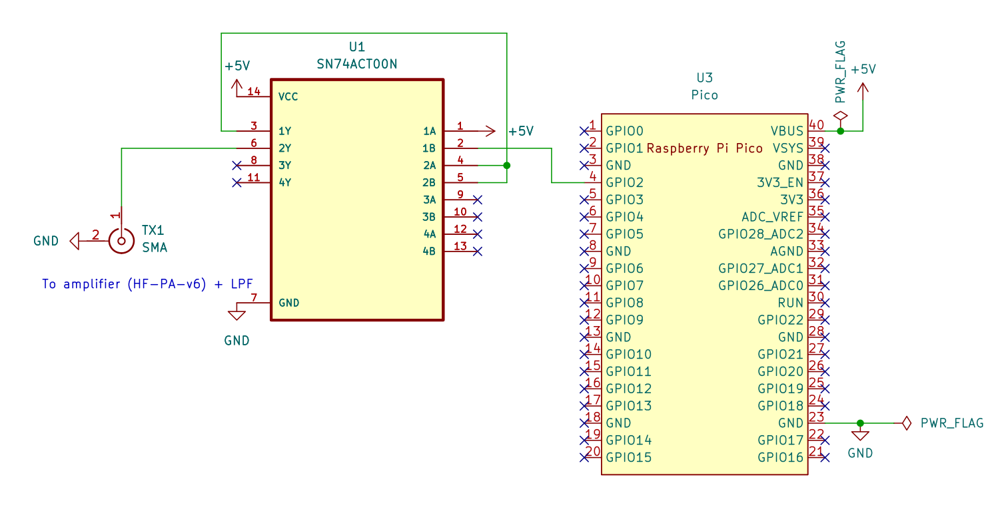
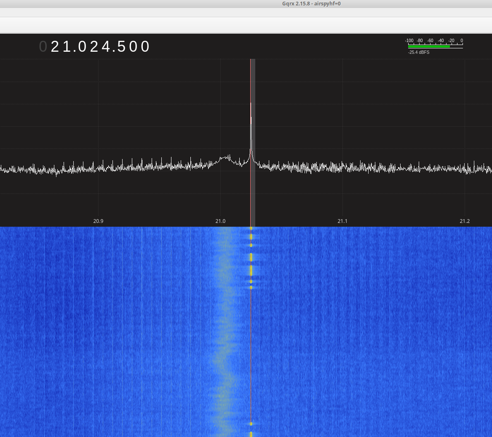
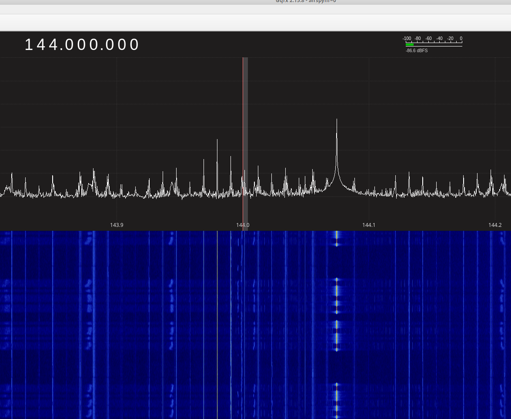
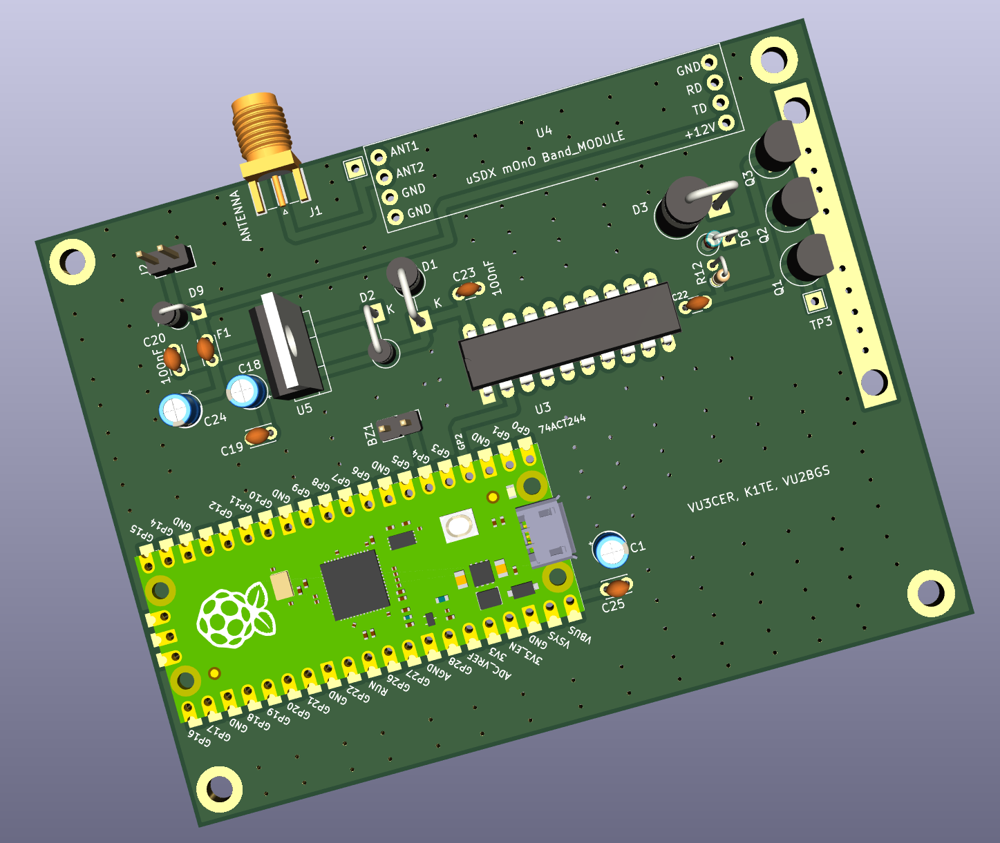
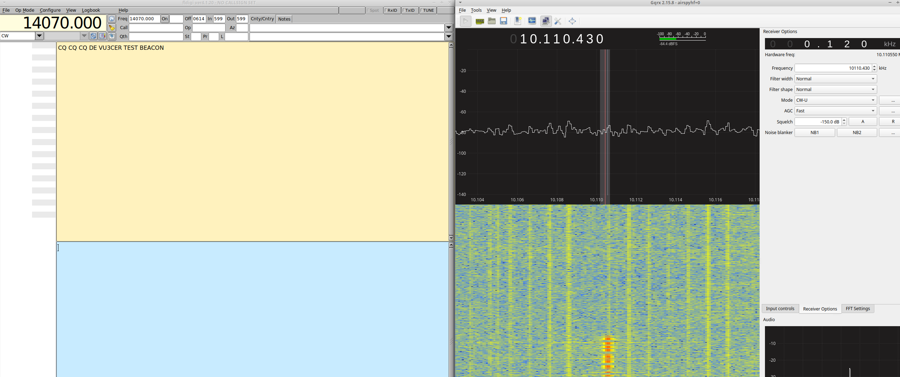
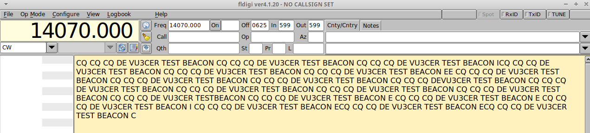
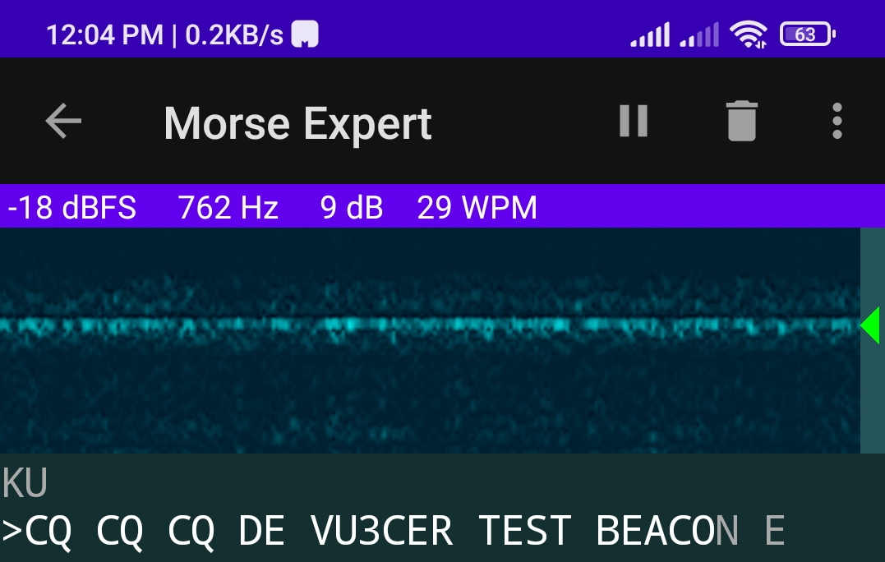

#### Details

This project generates a RF signal by toggling a GPIO pin (of a Raspberry Pi
Pico / Pico W board) at a high speed (HF frequency).


#### Build Steps

Note: This repository has pre-built firmware files in it (`*.uf2` files) for
testing, and debugging purposes.

The following steps demonstrate the process of re-building the firmware from
the source code.

Common steps:

```
sudo apt install cmake gcc-arm-none-eabi libnewlib-arm-none-eabi \
    libstdc++-arm-none-eabi-newlib

sudo apt install gqrx-sdr fldigi pavucontrol pavucontrol-qt pamix
```

```
./build.sh
```


#### Customizations

To customize the CW message, CW speed, and the message, please edit the
`blink.pio` and `message.h` files.

- CW beacon message can be changed in `message.h` file.

- WPM can be changed in `blink.pio` file.

  ```
  // https://www.codebug.org.uk/learn/step/541/morse-code-timing-rules/
  int dit_delay = 92; // 13 WPM
  ```

- RF frequency can be changed in `blink.pio` file.

  The default value targets the 30m band amateur radio band.

Note: Whenever you change these files, please run the following command to
build the firmware file(s).

```
./build_again.sh
```


#### Usage

Write `pio_blink_pico.uf2` to the Raspberry Pi Pico board OR write
`pio_blink_pico_w.uf2` to the Raspberry Pi Pico W board.

To do so, press the BOOTSEL button and hold it while you connect the other end
of the micro USB cable to your computer. This puts your Raspberry Pi Pico into
USB mass storage device mode. Drag and drop the appropriate .uf2 file to the
`Pico` drive.

Attach picocom or another serial terminal program to `/dev/ttyACM0` (typically)
for added fun.

https://projects.raspberrypi.org/en/projects/getting-started-with-the-pico has
additional details on this process.

Monitor the lower 30m or 144 MHz (2m) band using a SDR for receiving the CW
beacon.







#### Amplifier Options

- [QRPp-Amplifier-v2](./QRPp-Amplifier-v2)
- [QRPp-Amplifier-v3](./QRPp-Amplifier-v3)
- https://antrak.org.tr/blog/adx-arduino-digital-transceiver/ - ADX PA


#### Future Ideas

- Implement FM modulation for the `VHF Fox`.


#### PCB Render



Note: We may need to buffer GP2 with a 74ACT04 Hex Inverter IC before feeding
it to the 74ACT244 Octal Driver IC. Let's see how it goes...


#### Automatic CW Decoding




Setup a virtual audio cable:

```
pacmd load-module module-null-sink sink_name=Virtual0
pacmd update-sink-proplist Virtual0 device.description=Virtual0
pacmd update-source-proplist Virtual0.monitor device.description=Virtual0
```

Ask Gqrx to output audio to this `Virtual0` device.

Use `PulseAudio` device in Fldigi.

Using `pavucontrol` redirect the Fldigi input to come from `Virtual0`. Go to
the `Recording` tab in `pavucontrol` to do this.

You are all set for automatic CW decoding using `Fldigi` software now. Set `Op
Mode` to `CW` in Fldigi.

...

On Android, you can use the `Morse Expert` app for automatic CW decoding.




#### Credits

- Bradshaw Lupton - K1TE

- Gajendra Kumar - VU2BGS


#### References

- https://github.com/raspberrypi/pico-examples/blob/master/picoboard/blinky/blinky.c
