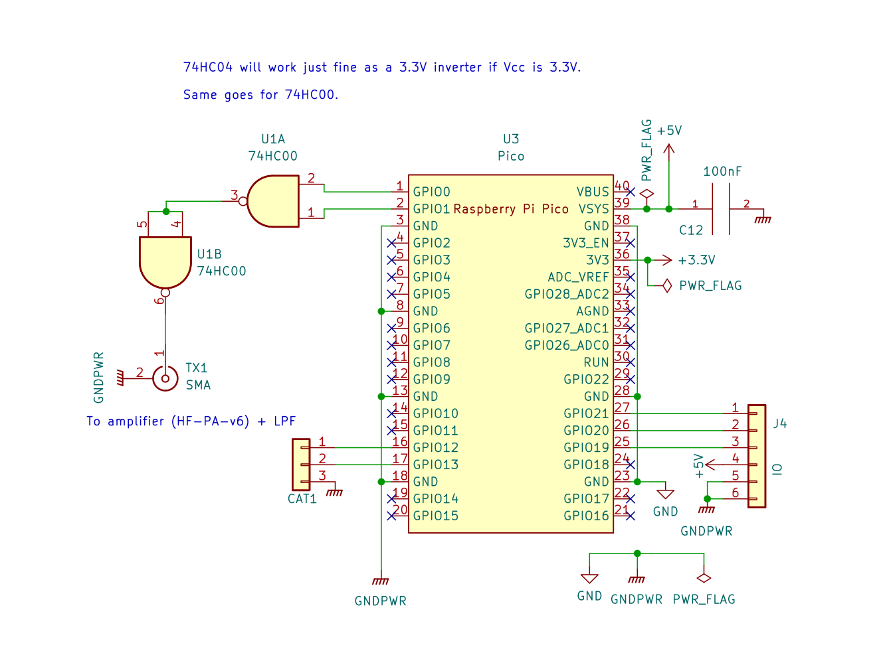

#### Build

```
mkdir -p ~/repos

cd ~/repos

git clone https://github.com/raspberrypi/pico-sdk.git

git clone https://github.com/kholia/pico-cw-beacon-drs.git

cd pico-cw-beacon-drs

export PICO_SDK_PATH=~/repos/pico-sdk

cmake .

make
```


#### Usage

Write `pio_blink.uf2` to the Raspberry Pi Pico board.

Monitor the lower 15m or 144 MHz (2m) band using a SDR for receiving the CW beacon.




#### Ideas

- Implement FM modulation for the `VHF Fox`.


#### References

- https://github.com/kholia/Easy-Digital-Beacons-v1/tree/master/CW-Beacon-Without-Si5351


#### Credits

- Bradshaw Lupton (K1TE)

- VU2BGS (Gajendra Kumar)
